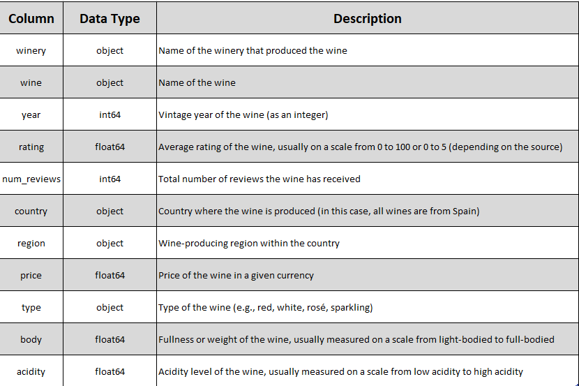
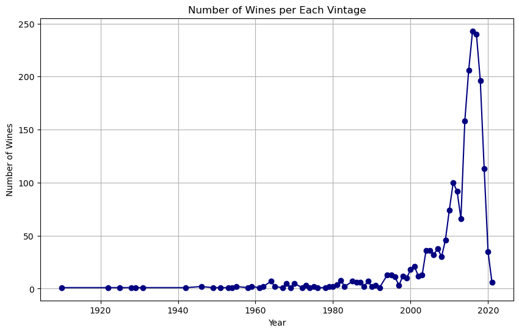
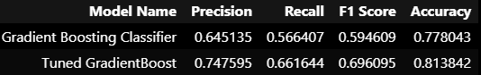

# Spanish Wine Market Insights
## Leveraging Machine Learning to Drive Effective Wine Selection for a New Market
**Business Problem** 
As a small wine distributor looking to introduce Spanish wines into a new market, understanding the terrain of consumer preferences and market trends can pose a significant challenge. To help navigate this challenge, our analysis employs machine learning - specifically gradient boosting regression models - to predict wine ratings, our target variable, based on historical data. These predictions provide essential insights into potential market responses to different wines, enabling the distributor to make informed selection and marketing decisions.

## Dataset and Description
The dataset, sourced from Kaggle, encapsulates a wide array of information about various Spanish wines.

Source: https://www.kaggle.com/datasets/fedesoriano/spanish-wine-quality-dataset

**Data Dictionary** 

## Exploratory Data Analysis

Insight: The number of wine reviews notably increased after 2003. This trend could be reflective of various factors, including a surge in global interest in the Spanish wine industry post-2003. Comprehending the drivers behind this increase can equip our stakeholders with critical insights for capitalizing on emergent market trends and making shrewd decisions about which wines to introduce to the new market.

# **Model Selection, Justification, and Performance

When selecting a model, our primary objective is to find the one that best predicts wine ratings (low, medium, or high) for Spanish wines in the new market. Accurate predictions can guide the distributor in identifying wines likely to be well-received, thereby potentially boosting sales and enhancing customer satisfaction.

Our analysis reveals the Tuned GradientBoost model outperforms the original Gradient Boosting Classifier on all evaluation metrics, indicating its superior reliability in predicting wine ratings.

Benefits of the Tuned GradientBoost Classifier:

*Enhanced Precision:* The Tuned GradientBoost model improves Precision from 0.645 to 0.748, suggesting better accuracy in predicting wines that will receive positive ratings. This improvement enables the distributor to concentrate on wines likely to succeed, minimizing the risk of investing in less favored options.

*Improved Recall:* The increase in Recall from 0.566 to 0.662 indicates the Tuned GradientBoost model's better performance in identifying positively rated wines. This improvement increases the likelihood of capturing a larger portion of high-quality wines, leading to potential demand growth and improved customer satisfaction.

*Superior F1 Score:* The F1 Score, a balance of Precision and Recall, rises from 0.595 to 0.696. This improvement demonstrates the Tuned GradientBoost model's enhanced overall performance in predicting wine ratings, enabling more precise and informed business decisions.

*Increased Accuracy:* Accuracy, a measure of correct predictions, improves from 0.778 to 0.814. This enhancement suggests the model's increased reliability, leading to more effective marketing strategies and efficient inventory management.

**Business Solution:** In conclusion, employing the Tuned GradientBoost model promises more accurate predictions. It can help the distributor optimize marketing efforts, streamline inventory management, and invest in the most promising wines, thereby potentially increasing sales, improving customer satisfaction, and boosting profitability.
 
 